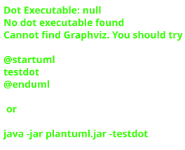

# 5. Bausteinsicht

### 5.1 Ebene 1: Gesamtsystem

Die App ist in drei Hauptschichten unterteilt:

1.  **UI Layer (`de.kindermaenner.monatsblitz.ui`):** Enthält Compose-Screens und ViewModels.
2.  **Domain Layer (`de.kindermaenner.monatsblitz.domain`):** Enthält Modelle, Repository-Interfaces und Use Cases.
3.  **Infrastructure Layer (`de.kindermaenner.monatsblitz.infrastructure`):** Enthält Implementierungen für API-Zugriff (Retrofit), Datenbank (Room), App-Zustand (DataStore) und Repositories.

