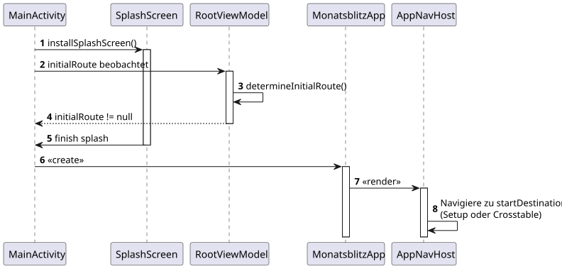
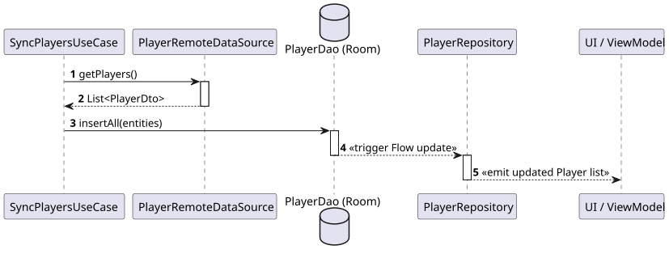
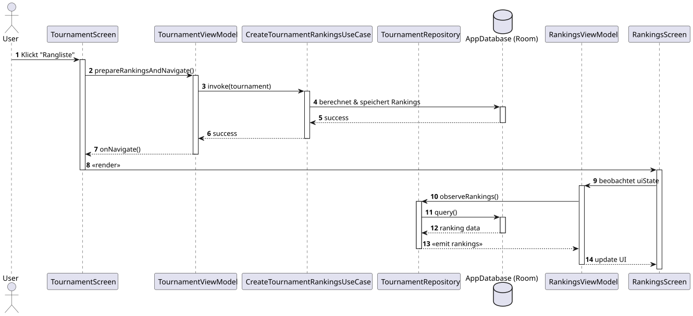

# 6. Laufzeitsicht

### 6.1 Navigation und Turnierstart
Der standardisierte Navigationsfluss via Jetpack Navigation Component:

### 6.2 Synchronisation mit REST-API
Der Sync-Prozess befüllt die lokale SSoT (Datenbank), ohne dass die UI direkt mit der API kommuniziert.

### 6.3 Ergebniseingabe und Ranking-Aktualisierung
Der Prozess der Ranking-Aktualisierung folgt einem unidirektionalen Fluss über die Datenbank.

